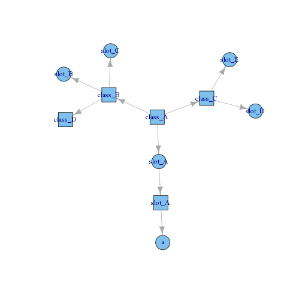

# packagestructure

Create a graph of the structure of an `R` package.

Currently only supports S4 classes and slots.

## Installation

```
devtools::install_github("rmflight/packagestructure")
```

## Example


```r
library(packagestructure)
example_package <- system.file("exampledata", package = "packagestructure")
e_g <- class_graph(example_package)
plot(e_g)
```

 

## TODO

* improve test coverage (classunion and no-classes)
* add travis-ci
* allow specification of classes to show and classes to exclude
